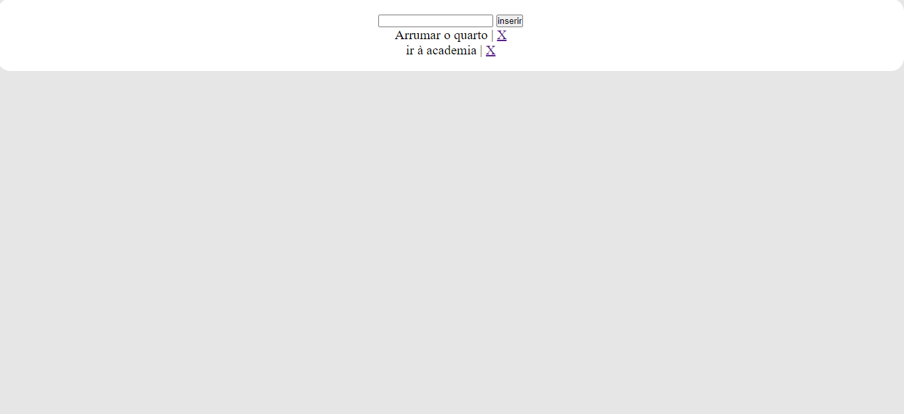
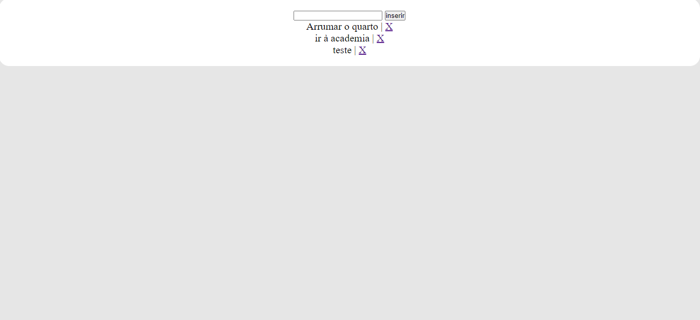
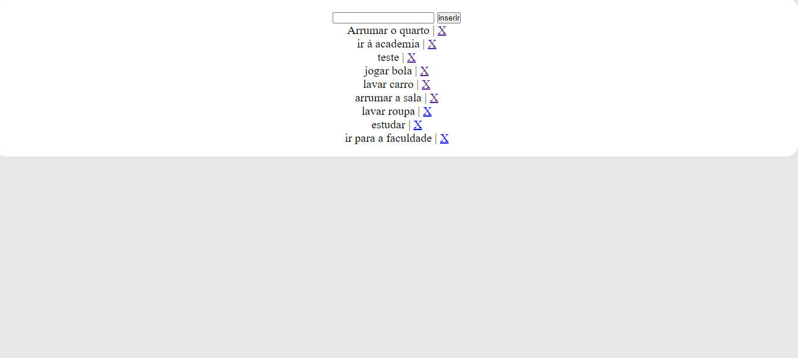

# Site de Tarefas com Node.js e Express.js

Bem-vindo ao repositório do Site de Tarefas desenvolvido com Node.js e Express.js. Este é um aplicativo simples que permite adicionar e excluir tarefas. O objetivo do projeto era criar rotas e a configuração do Express para usar o EJS como mecanismo de renderização de HTML e configuração do diretório "public" oara servir arquivos estáticos, como o JS e o CSS.

## Tecnologias utilizadas:

<p align="center">
  
  
  
</p>

## Dependências utilizadas:
```
$ npm install express ejs body-parser
```
## Capturas de Tela:





